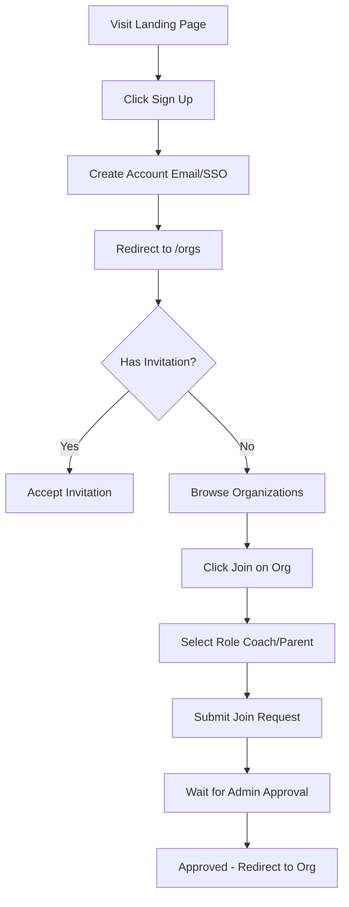
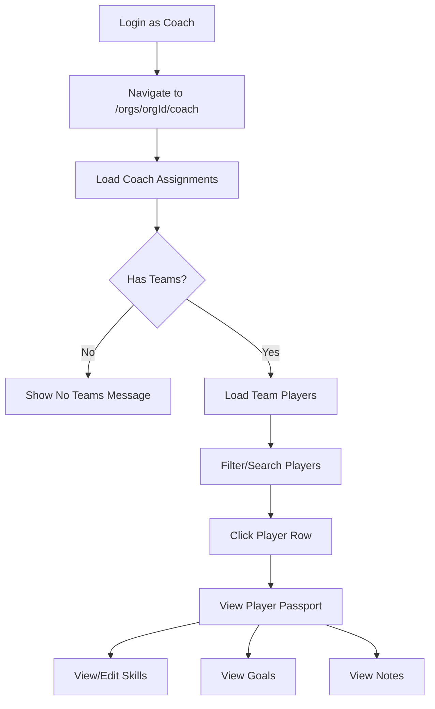
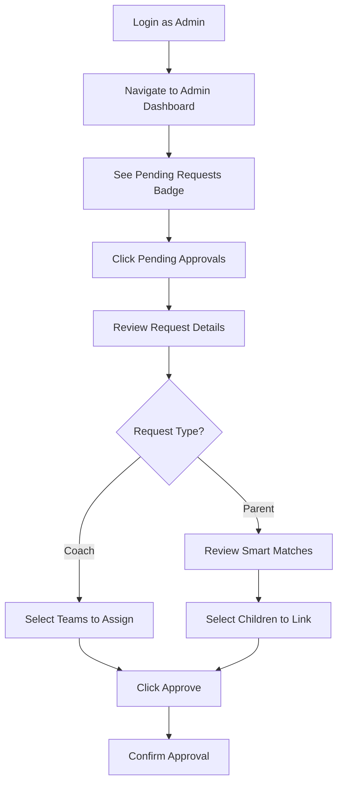
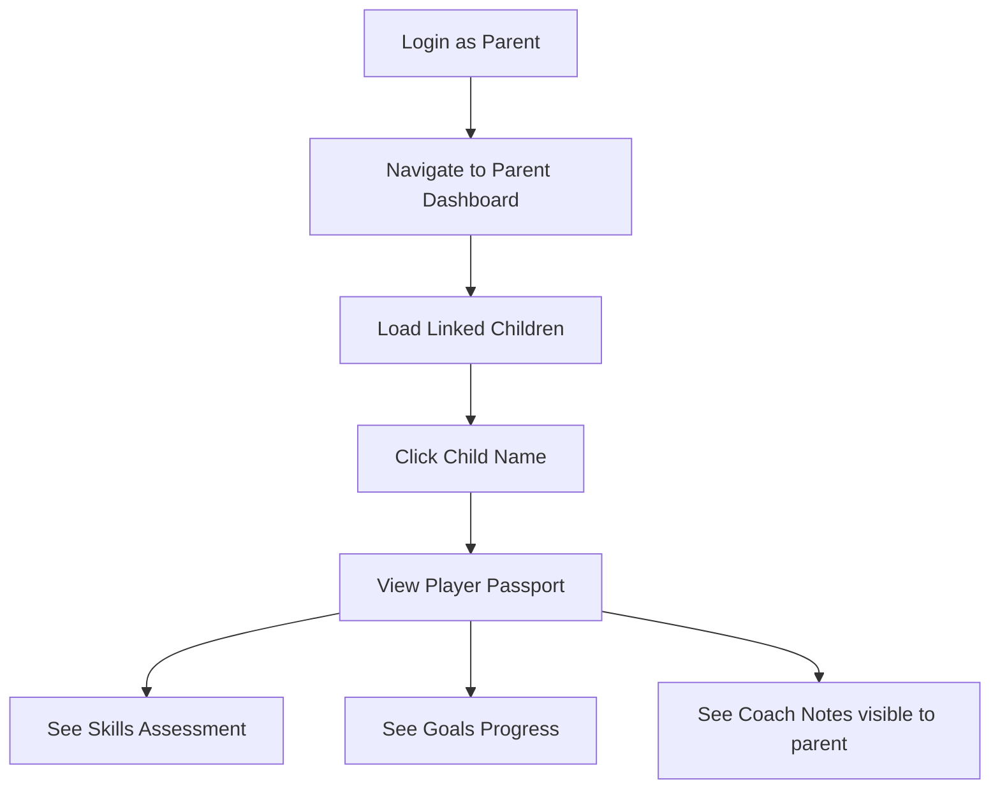

# PDP/PlayerARC User Testing Process

## Comprehensive UAT, Compliance, and Quality Assurance Documentation

**Version:** 1.1  
**Date:** January 2026  
**Status:** Ready for Execution - Playwright UAT Tests Added

---

## 1. Application & Architecture Understanding (Code-Derived)

### 1.1 Application Purpose & Business Domain

The PDP (Player Development Platform) / PlayerARC is a **multi-organization sports player development tracking system** designed to:

- Track youth and adult athlete skill development across sports (GAA Football, Soccer, Rugby)
- Provide player "passports" documenting skills, positions, fitness, and development goals
- Enable coaches to manage teams, assess players, and record observations
- Allow parents to view their children's development progress
- Support organization administrators in managing memberships and team structures
- Compare player assessments against NGB (National Governing Body) benchmarks

### 1.2 Architecture Summary

| Component | Technology | Details |
|-----------|------------|---------|
| **Frontend** | Next.js 14 (App Router) | React server & client components |
| **Authentication** | Better Auth | Email/password + Google + Microsoft SSO |
| **Database** | Convex | Real-time serverless database |
| **API Layer** | Convex Functions | Queries, mutations, actions |
| **Deployment** | Vercel | Production hosting |
| **State Management** | React hooks + Convex queries | Real-time reactive data |

### 1.3 Routing Structure (App Router)

```
/                           # Landing page (public)
/login                      # Authentication page
/signup                     # Registration page
/demo                       # Demo request form (public)
/blog                       # Blog posts (public)
/blog/[slug]               # Individual blog post

/orgs                       # Organization selection
/orgs/create               # Create new organization (platform staff only)
/orgs/join                 # List of joinable organizations
/orgs/join/[orgId]         # Join specific organization
/orgs/accept-invitation/[invitationId]  # Accept email invitation
/orgs/current              # Redirect to active organization

/orgs/[orgId]              # Organization home/dashboard
/orgs/[orgId]/request-role # Request additional functional roles

# Admin Routes
/orgs/[orgId]/admin                    # Admin dashboard
/orgs/[orgId]/admin/players            # Player management
/orgs/[orgId]/admin/teams              # Team management
/orgs/[orgId]/admin/coaches            # Coach management
/orgs/[orgId]/admin/users              # User/member management
/orgs/[orgId]/admin/users/approvals    # Membership request approvals
/orgs/[orgId]/admin/benchmarks         # NGB benchmark management
/orgs/[orgId]/admin/gaa-import         # GAA membership import
/orgs/[orgId]/admin/player-import      # Bulk player import
/orgs/[orgId]/admin/settings           # Organization settings

# Coach Routes
/orgs/[orgId]/coach                    # Coach dashboard (Smart Coach)
/orgs/[orgId]/coach/assess             # Player assessment tools
/orgs/[orgId]/coach/injuries           # Injury tracking
/orgs/[orgId]/coach/voice-notes        # Voice notes & AI insights

# Parent Routes
/orgs/[orgId]/parents                  # Parent dashboard

# Player Routes
/orgs/[orgId]/players/[playerId]       # Player passport view
```

### 1.4 User Roles & Permission System

The system uses a **dual-layer role architecture**:

#### Better Auth Hierarchy Roles (Access Level)
| Role | Description |
|------|-------------|
| `owner` | Organization creator, full control |
| `admin` | Administrative access, user management |
| `member` | Basic membership |

#### Functional Roles (Capabilities)
| Role | Description |
|------|-------------|
| `admin` | Can manage users, settings, approve requests |
| `coach` | Can view/edit assigned team players, assessments |
| `parent` | Can view linked children's passports |

**Key Rule:** Users can have multiple functional roles simultaneously (e.g., a coach who is also a parent).

### 1.5 Data Model Overview

**Platform-Level Entities (Cross-Organization):**
- `playerIdentities` - Unique player records
- `guardianIdentities` - Parent/guardian records
- `guardianPlayerLinks` - Parent-child relationships
- `playerInjuries` - Injury records (visible across orgs with consent)

**Organization-Scoped Entities:**
- `orgPlayerEnrollments` - Player membership in org
- `players` (legacy) - Player records
- `coachAssignments` - Coach team assignments
- `teamPlayerIdentities` - Team rosters
- `orgJoinRequests` - Membership requests

**Reference Data:**
- `sports` - Sport definitions (GAA, Soccer, Rugby)
- `ageGroups` - Age group definitions (U6-Senior)
- `skillCategories` - Skill groupings
- `skillDefinitions` - Individual skills
- `skillBenchmarks` - NGB standards

### 1.6 Sensitive Data Flows

| Data Type | PII Level | Storage | Access Control |
|-----------|-----------|---------|----------------|
| User email/name | High | Better Auth | Session-based |
| Player DOB | High | playerIdentities | Org membership + role |
| Medical profiles | Critical | medicalProfiles | Coach/Admin only |
| Parent phone/address | High | guardianIdentities | Admin + linked parent |
| Injury records | High | playerInjuries | Visibility flag controlled |
| Skills assessments | Medium | skillAssessments | Org-scoped |

---

## 2. User Personas & Journeys

### 2.1 User Personas

#### Persona 1: Platform Staff (Super Admin)
- **Role:** Platform-level administrator
- **Access:** `isPlatformStaff: true` flag in user record
- **Capabilities:** Create organizations, manage platform settings
- **Journey Entry:** Direct backend flag assignment

#### Persona 2: Organization Owner
- **Role:** Organization creator/owner
- **Access:** Better Auth `owner` role + functional `admin`
- **Capabilities:** Full org control, ownership transfer, org deletion
- **Journey Entry:** Creates organization or receives ownership transfer

#### Persona 3: Organization Admin
- **Role:** Admin staff member
- **Access:** Better Auth `admin` role + functional `admin`
- **Capabilities:** User management, approvals, settings (except ownership)
- **Journey Entry:** Approved with admin functional role

#### Persona 4: Coach
- **Role:** Team coach/manager
- **Access:** Better Auth `member` + functional `coach`
- **Capabilities:** View/edit assigned team players, assessments, voice notes
- **Journey Entry:** Approved join request with coach role, assigned teams

#### Persona 5: Parent/Guardian
- **Role:** Player's parent
- **Access:** Better Auth `member` + functional `parent`
- **Capabilities:** View linked children's passports, goals, notes
- **Journey Entry:** Approved join request, children linked via email/smart match

#### Persona 6: Multi-Role User
- **Role:** Combined (e.g., Coach + Parent)
- **Access:** Better Auth `member` + multiple functional roles
- **Capabilities:** Combined capabilities of all assigned roles
- **Journey Entry:** Multiple role requests approved

### 2.2 User Journey Maps

#### Journey 1: New User Registration & Organization Join



**Backend Touchpoints:**
1. `POST /api/auth/signup` - Better Auth registration
2. `query: members.getMembersForAllOrganizations` - Check existing memberships
3. `query: orgJoinRequests.getAllOrganizations` - List joinable orgs
4. `mutation: orgJoinRequests.createJoinRequest` - Submit request
5. `mutation: orgJoinRequests.approveJoinRequest` - Admin approval

#### Journey 2: Coach Dashboard & Player Assessment



**Backend Touchpoints:**
1. `query: coaches.getCoachAssignments` - Get assigned teams
2. `query: orgPlayerEnrollments.getPlayersForOrg` - Get players
3. `query: teamPlayerIdentities.getTeamMembersForOrg` - Get team links
4. `query: sportPassports.getFullPlayerPassportView` - Player details

#### Journey 3: Admin Approval Workflow



**Backend Touchpoints:**
1. `query: orgJoinRequests.getPendingRequestsForOrg` - Get pending
2. `query: teams.getTeamsByOrganization` - Get teams for assignment
3. `query: players.getSmartMatchesForParent` - Find matching children
4. `mutation: orgJoinRequests.approveJoinRequest` - Process approval

#### Journey 4: Parent Viewing Child's Progress



**Backend Touchpoints:**
1. `query: members.getMemberRoleDetails` - Verify parent role
2. `query: guardianPlayerLinks` via hook - Get linked children
3. `query: sportPassports.getFullPlayerPassportView` - Child's passport

---

## 3. Test Scope & Strategy

### 3.1 Manual User Testing Scope

| Category | Manual Testing Required | Reason |
|----------|------------------------|--------|
| Authentication flows | Yes | Critical security path |
| Role-based access | Yes | Permission verification |
| Join request workflow | Yes | Multi-step user interaction |
| Coach dashboard | Yes | Complex filtering/navigation |
| Parent child linking | Yes | Smart matching validation |
| Player passport view | Yes | Data display correctness |
| Organization theming | Yes | Visual verification |
| Mobile responsiveness | Yes | Cross-device UX |
| Error handling | Yes | User-facing messages |

### 3.2 Automated Testing Coverage (Recommended)

| Category | Automated Testing | Tool Recommendation |
|----------|------------------|---------------------|
| Convex mutations | Unit tests | Vitest + Convex test helpers |
| Permission checks | Integration tests | Convex test utilities |
| Component rendering | Component tests | React Testing Library |
| API responses | Integration tests | Vitest |
| E2E critical paths | E2E tests | Playwright |

### 3.3 Test Environments

| Environment | URL Pattern | Purpose |
|-------------|-------------|---------|
| Local | `http://localhost:3000` | Development testing |
| Preview | `https://pdp-*-vercel.app` | PR/branch preview |
| Staging | TBD | Pre-production validation |
| Production | Production URL | Smoke testing only |

### 3.4 Required Test Data

#### User Accounts
| Role | Email Pattern | Password | Notes |
|------|---------------|----------|-------|
| Platform Staff | `staff_pdp@outlook.com` | `Ask John` | Has `isPlatformStaff: true` |
| Org Owner | `owner_pdp@outlook.com` | `Ask John` | Created test org |
| Admin | `adm1n_pdp@outlook.com` | `Ask John` | Approved as admin |
| Coach | `coach_pdp@outlook.com` | `Ask John` | Has team assignments |
| Parent | `parent_pdp@outlook.com` | `Ask John` | Has linked children |
| Multi-Role | `multi_pdp@outlook.com` | `Ask John` | Coach + Parent roles |
| New User | `newuser_pdp@outlook.com` | `Ask John` | Fresh account |

#### Test Organization
- **Name:** Test Club FC
- **Colors:** Primary `#2563eb`, Secondary `#059669`
- **Teams:** U10 Boys, U12 Girls, U14 Boys

#### Test Players
- 10+ players per team with varied:
  - Age groups (U8 - U16)
  - Genders (Male, Female)
  - Skills (varied ratings 1-5)
  - Parent email associations

### 3.5 Third-Party Dependencies

| Service | Purpose | Test Strategy |
|---------|---------|---------------|
| Better Auth | Authentication | Use test credentials |
| Convex | Database | Use dev Convex instance |
| Google OAuth | SSO | Skip in UAT, test separately |
| Microsoft OAuth | SSO | Skip in UAT, test separately |
| Resend (Email) | Invitations | Check logs, mock in tests |

---

## 4. Step-by-Step User Testing Plan

### 4.1 Authentication & Onboarding Tests

#### TEST-AUTH-001: Email Registration
| Field | Value |
|-------|-------|
| **Test Objective** | Verify new user can register with email/password |
| **User Role** | Anonymous |
| **Preconditions** | Email not previously registered |
| **Steps** | 1. Navigate to `/signup`<br>2. Enter name: "Test User"<br>3. Enter email: `newtest@example.com`<br>4. Enter password: `SecurePass123!`<br>5. Click "Create Account" |
| **Expected UI** | Loading spinner → Redirect to `/orgs` → Show org selection |
| **Expected Backend** | User created in Better Auth, session established |
| **Expected Data** | New user record in Convex auth tables |
| **Failure Cases** | Duplicate email → Error "Email already registered"<br>Weak password → Validation error |
| **Compliance** | GDPR: Minimal data collection, no marketing consent yet |

#### TEST-AUTH-002: Google SSO Login
| Field | Value |
|-------|-------|
| **Test Objective** | Verify Google OAuth login flow |
| **User Role** | Anonymous |
| **Preconditions** | Valid Google account |
| **Steps** | 1. Navigate to `/login`<br>2. Click "Sign in with Google"<br>3. Complete Google OAuth flow<br>4. Return to application |
| **Expected UI** | Redirect to Google → Back to app → `/orgs` page |
| **Expected Backend** | OAuth token exchange, user creation/lookup |
| **Expected Data** | User record with Google account linked |
| **Failure Cases** | OAuth denied → Return to login with error<br>Network error → Timeout message |
| **Compliance** | OAuth token not stored beyond session |

#### TEST-AUTH-003: Session Persistence
| Field | Value |
|-------|-------|
| **Test Objective** | Verify session survives page refresh |
| **User Role** | Any authenticated |
| **Preconditions** | User logged in |
| **Steps** | 1. Login successfully<br>2. Note current page<br>3. Refresh browser (F5)<br>4. Observe state |
| **Expected UI** | Same page loads, user still authenticated |
| **Expected Backend** | Session token validated |
| **Expected Data** | No changes |
| **Failure Cases** | Session expired → Redirect to login |

#### TEST-AUTH-004: Logout
| Field | Value |
|-------|-------|
| **Test Objective** | Verify logout clears session |
| **User Role** | Any authenticated |
| **Preconditions** | User logged in |
| **Steps** | 1. Click user menu<br>2. Click "Logout"<br>3. Try accessing protected route |
| **Expected UI** | Redirect to `/login`, no user data visible |
| **Expected Backend** | Session invalidated |
| **Expected Data** | Session token revoked |
| **Failure Cases** | N/A |
| **Compliance** | Session cleanup on logout |

### 4.2 Organization Join Flow Tests

#### TEST-JOIN-001: Browse Available Organizations
| Field | Value |
|-------|-------|
| **Test Objective** | Verify user can see list of joinable organizations |
| **User Role** | Authenticated, no memberships |
| **Preconditions** | At least one organization exists |
| **Steps** | 1. Navigate to `/orgs/join`<br>2. Observe organization list |
| **Expected UI** | List of organizations with names, logos, member counts |
| **Expected Backend** | `orgJoinRequests.getAllOrganizations` called |
| **Expected Data** | Query returns org list |
| **Failure Cases** | No orgs → Empty state message |

#### TEST-JOIN-002: Submit Join Request (Coach)
| Field | Value |
|-------|-------|
| **Test Objective** | Verify coach join request with sport/team preferences |
| **User Role** | Authenticated, no membership in target org |
| **Preconditions** | Target org exists |
| **Steps** | 1. Navigate to `/orgs/join/[orgId]`<br>2. Select "Coach" role<br>3. Enter sport: "GAA Football"<br>4. Enter teams: "U10 Boys"<br>5. Enter age groups: "U10"<br>6. Add optional message<br>7. Click "Submit Request" |
| **Expected UI** | Success toast, redirect to org list with "Pending" badge |
| **Expected Backend** | `orgJoinRequests.createJoinRequest` called |
| **Expected Data** | New `orgJoinRequests` record with `status: "pending"`, coach fields populated |
| **Failure Cases** | Already member → Error "Already a member"<br>Pending request exists → Error "Already pending" |

#### TEST-JOIN-003: Submit Join Request (Parent)
| Field | Value |
|-------|-------|
| **Test Objective** | Verify parent join request with children info |
| **User Role** | Authenticated, no membership |
| **Preconditions** | Target org exists with players |
| **Steps** | 1. Navigate to `/orgs/join/[orgId]`<br>2. Select "Parent" role<br>3. Enter phone number<br>4. Enter address (optional)<br>5. Add child: Name "John Smith", Age 10, Team "U10 Boys"<br>6. Click "Submit Request" |
| **Expected UI** | Success toast, redirect with pending status |
| **Expected Backend** | `orgJoinRequests.createJoinRequest` called |
| **Expected Data** | New record with `requestedFunctionalRoles: ["parent"]`, children JSON |
| **Failure Cases** | Invalid JSON → Validation error |

#### TEST-JOIN-004: Cancel Pending Request
| Field | Value |
|-------|-------|
| **Test Objective** | Verify user can cancel own pending request |
| **User Role** | Authenticated with pending request |
| **Preconditions** | Pending join request exists |
| **Steps** | 1. Navigate to `/orgs`<br>2. Find request with "Pending" status<br>3. Click "Cancel Request" button<br>4. Confirm cancellation |
| **Expected UI** | Request removed from list, success toast |
| **Expected Backend** | `orgJoinRequests.cancelJoinRequest` called |
| **Expected Data** | `orgJoinRequests` record deleted |
| **Failure Cases** | Already processed → Error "Not pending" |

### 4.3 Admin Approval Workflow Tests

#### TEST-ADMIN-001: View Pending Requests
| Field | Value |
|-------|-------|
| **Test Objective** | Verify admin can see all pending membership requests |
| **User Role** | Admin or Owner |
| **Preconditions** | Pending requests exist |
| **Steps** | 1. Login as admin<br>2. Navigate to `/orgs/[orgId]/admin`<br>3. Note pending count badge<br>4. Click "View All" or navigate to `/admin/users/approvals` |
| **Expected UI** | List of pending requests with user info, roles requested, date |
| **Expected Backend** | `orgJoinRequests.getPendingRequestsForOrg` called |
| **Expected Data** | All pending requests for org returned |
| **Failure Cases** | Not admin → Error "Must be admin or owner" |

#### TEST-ADMIN-002: Approve Coach Request with Team Assignment
| Field | Value |
|-------|-------|
| **Test Objective** | Verify admin can approve coach and assign teams |
| **User Role** | Admin |
| **Preconditions** | Pending coach request, teams exist |
| **Steps** | 1. Navigate to approvals page<br>2. Find coach request<br>3. Click "Configure & Approve"<br>4. Select teams: "U10 Boys", "U12 Boys"<br>5. Click "Approve & Add to Org" |
| **Expected UI** | Dialog closes, request removed from list, success toast |
| **Expected Backend** | `orgJoinRequests.approveJoinRequest` with `coachTeams` |
| **Expected Data** | Member created with `functionalRoles: ["coach"]`, `coachAssignments` record created |
| **Failure Cases** | No teams selected → Approved without assignment (valid) |

#### TEST-ADMIN-003: Approve Parent Request with Smart Matching
| Field | Value |
|-------|-------|
| **Test Objective** | Verify smart matching suggests correct children |
| **User Role** | Admin |
| **Preconditions** | Parent request with matching player by surname/email |
| **Steps** | 1. Navigate to approvals page<br>2. Find parent request (parent email matches player's `parentEmail` or `inferredParentEmail`)<br>3. Click "Configure & Approve"<br>4. Review "High Confidence Matches"<br>5. Select matched children<br>6. Click "Approve & Add to Org" |
| **Expected UI** | Smart matches shown with confidence badges, selected children highlighted |
| **Expected Backend** | `players.getSmartMatchesForParent` returns matches, `approveJoinRequest` with `linkedPlayerIds` |
| **Expected Data** | Member created, player `parentEmail` field updated |
| **Failure Cases** | No matches → "No potential matches found" message |

#### TEST-ADMIN-004: Reject Request with Reason
| Field | Value |
|-------|-------|
| **Test Objective** | Verify admin can reject with required reason |
| **User Role** | Admin |
| **Preconditions** | Pending request exists |
| **Steps** | 1. Navigate to approvals page<br>2. Click "Reject" on request<br>3. Enter reason: "Unable to verify identity"<br>4. Click "Confirm Rejection" |
| **Expected UI** | Dialog closes, request removed, success toast |
| **Expected Backend** | `orgJoinRequests.rejectJoinRequest` called |
| **Expected Data** | Request `status: "rejected"`, `rejectionReason` populated, `reviewedBy` set |
| **Failure Cases** | Empty reason → Button disabled |
| **Compliance** | Audit: Rejection reason recorded for compliance |

### 4.4 Coach Dashboard Tests

#### TEST-COACH-001: View Assigned Team Players
| Field | Value |
|-------|-------|
| **Test Objective** | Verify coach sees only assigned team players |
| **User Role** | Coach |
| **Preconditions** | Coach assigned to "U10 Boys" team, team has 5 players |
| **Steps** | 1. Login as coach<br>2. Navigate to `/orgs/[orgId]/coach`<br>3. Observe player list |
| **Expected UI** | Smart Coach Dashboard shows 5 players, team filter shows "U10 Boys" |
| **Expected Backend** | Queries chain: `coaches.getCoachAssignments` → `teamPlayerIdentities.getTeamMembersForOrg` → filter |
| **Expected Data** | Only players linked to assigned teams returned |
| **Failure Cases** | No assignments → "No Teams Assigned" message |

#### TEST-COACH-002: Filter Players by Team
| Field | Value |
|-------|-------|
| **Test Objective** | Verify team filter works correctly |
| **User Role** | Coach with multiple teams |
| **Preconditions** | Coach assigned to 2+ teams |
| **Steps** | 1. Load coach dashboard<br>2. Click team name in team cards<br>3. Observe player list update |
| **Expected UI** | Player list filters to selected team, team card highlighted |
| **Expected Backend** | Client-side filtering, no additional queries |
| **Expected Data** | Same data, different display |
| **Failure Cases** | N/A |

#### TEST-COACH-003: Navigate to Player Passport
| Field | Value |
|-------|-------|
| **Test Objective** | Verify coach can view player details |
| **User Role** | Coach |
| **Preconditions** | Players in assigned teams |
| **Steps** | 1. From coach dashboard<br>2. Click player row or "View" button<br>3. Observe player passport page |
| **Expected UI** | Redirect to `/orgs/[orgId]/players/[playerId]`, full passport displayed |
| **Expected Backend** | `sportPassports.getFullPlayerPassportView` or `players.getPlayerPassport` |
| **Expected Data** | Player details, skills, goals, notes |
| **Failure Cases** | Player not found → "Player Not Found" message |

#### TEST-COACH-004: Filter by Review Status
| Field | Value |
|-------|-------|
| **Test Objective** | Verify review status filter functionality |
| **User Role** | Coach |
| **Preconditions** | Players with varied review statuses |
| **Steps** | 1. Load coach dashboard<br>2. Click "Overdue" filter or badge<br>3. Observe filtered list |
| **Expected UI** | Only players with "Overdue" status shown |
| **Expected Backend** | Client-side filtering |
| **Expected Data** | Same data |
| **Failure Cases** | No overdue → Empty state |

### 4.5 Parent Dashboard Tests

#### TEST-PARENT-001: View Linked Children
| Field | Value |
|-------|-------|
| **Test Objective** | Verify parent sees linked children |
| **User Role** | Parent |
| **Preconditions** | Parent has `parent` functional role, children linked |
| **Steps** | 1. Login as parent<br>2. Navigate to `/orgs/[orgId]/parents`<br>3. Observe children list |
| **Expected UI** | Children cards with names, age groups, click to view |
| **Expected Backend** | `guardianPlayerLinks` query via hook or `players.getPlayersForParent` |
| **Expected Data** | Only linked children returned |
| **Failure Cases** | No children linked → "No children linked yet" message |

#### TEST-PARENT-002: Access Denied Without Parent Role
| Field | Value |
|-------|-------|
| **Test Objective** | Verify non-parents cannot access parent dashboard |
| **User Role** | Coach only (no parent role) |
| **Preconditions** | User is coach without parent functional role |
| **Steps** | 1. Login as coach<br>2. Manually navigate to `/orgs/[orgId]/parents` |
| **Expected UI** | "Parent Access Required" message with instructions |
| **Expected Backend** | `members.getMemberRoleDetails` returns no parent role |
| **Expected Data** | N/A |
| **Failure Cases** | N/A (this IS the failure case) |

### 4.6 Player Passport Tests

#### TEST-PASSPORT-001: View Player Passport (Coach)
| Field | Value |
|-------|-------|
| **Test Objective** | Verify coach can view full player passport |
| **User Role** | Coach |
| **Preconditions** | Player in coach's assigned team |
| **Steps** | 1. Navigate to `/orgs/[orgId]/players/[playerId]`<br>2. Observe all sections |
| **Expected UI** | Basic Info, Skills, Positions/Fitness, Goals, Notes sections visible |
| **Expected Backend** | `sportPassports.getFullPlayerPassportView` or legacy query |
| **Expected Data** | Full player record |
| **Failure Cases** | Not authorized → "Player Not Found" |

#### TEST-PASSPORT-002: View Benchmark Comparison
| Field | Value |
|-------|-------|
| **Test Objective** | Verify NGB benchmark comparison displays |
| **User Role** | Coach or Parent |
| **Preconditions** | Player in new identity system with sport passport, benchmarks configured |
| **Steps** | 1. View player passport<br>2. Scroll to Benchmark Comparison section<br>3. Observe skill vs benchmark ratings |
| **Expected UI** | Skills listed with player rating vs benchmark, color-coded status |
| **Expected Backend** | `BenchmarkComparison` component queries benchmarks |
| **Expected Data** | Benchmark records for player's sport/age group |
| **Failure Cases** | No benchmarks → Section hidden or "No benchmarks available" |

#### TEST-PASSPORT-003: Edit Button Visibility
| Field | Value |
|-------|-------|
| **Test Objective** | Verify edit permissions based on role |
| **User Role** | Coach, Parent, Admin |
| **Preconditions** | Same player viewed by different roles |
| **Steps** | 1. View passport as coach → See "Edit Player" button<br>2. View passport as parent → No "Edit Player" button<br>3. View passport as admin → See "Edit Player" button |
| **Expected UI** | Edit button visible only to coach/admin |
| **Expected Backend** | `members.getMemberRoleDetails` determines `canEdit` |
| **Expected Data** | N/A |
| **Failure Cases** | Wrong permissions → Button shown/hidden incorrectly |

### 4.7 Role Request Tests (Existing Members)

#### TEST-ROLE-001: Request Additional Role
| Field | Value |
|-------|-------|
| **Test Objective** | Verify member can request additional functional role |
| **User Role** | Member with `coach` role, wants `parent` role |
| **Preconditions** | User is org member without parent role |
| **Steps** | 1. Navigate to `/orgs/[orgId]/request-role`<br>2. See current roles listed<br>3. Click "Parent" role option<br>4. Click "Submit Request" |
| **Expected UI** | Request added to "Pending" list, success feedback |
| **Expected Backend** | `members.requestFunctionalRole` mutation |
| **Expected Data** | `pendingRoleRequests` array updated on member record |
| **Failure Cases** | Already has role → Role not in available list |

#### TEST-ROLE-002: Cancel Role Request
| Field | Value |
|-------|-------|
| **Test Objective** | Verify member can cancel pending role request |
| **User Role** | Member with pending request |
| **Preconditions** | Pending role request exists |
| **Steps** | 1. Navigate to role request page<br>2. Find pending request<br>3. Click "Cancel" button |
| **Expected UI** | Request removed from pending list |
| **Expected Backend** | `members.cancelFunctionalRoleRequest` mutation |
| **Expected Data** | Request removed from `pendingRoleRequests` |
| **Failure Cases** | Request already processed → Error |

#### TEST-ROLE-003: Admin Approves Role Request
| Field | Value |
|-------|-------|
| **Test Objective** | Verify admin can approve functional role request |
| **User Role** | Admin |
| **Preconditions** | Pending role request from existing member |
| **Steps** | 1. Navigate to `/admin/users/approvals`<br>2. Find role request in "Role Requests" section<br>3. Click "Grant [Role] Role" |
| **Expected UI** | Request removed, success toast |
| **Expected Backend** | `members.approveFunctionalRoleRequest` mutation |
| **Expected Data** | Role added to member's `functionalRoles` array, removed from `pendingRoleRequests` |
| **Failure Cases** | N/A |

---

## 5. React & Next.js-Specific UX Validation

### 5.1 Client vs Server Component Behavior

| Component/Page | Type | Validation Points |
|----------------|------|-------------------|
| `/orgs/[orgId]/admin/page.tsx` | Client (`"use client"`) | Verify queries run client-side, loading states show |
| `/orgs/[orgId]/coach/page.tsx` | Client | Suspense fallback shows loader |
| `layout.tsx` files | Server | No hydration mismatch errors |
| `BenchmarkComparison` | Client | Real-time query updates work |

### 5.2 Loading States & Suspense

#### TEST-UX-001: Coach Dashboard Loading State
| Test | Expected Behavior |
|------|-------------------|
| Initial load | Full-page loader while `coachAssignments` loading |
| Query error | "Authentication Required" or "No Teams Assigned" message |
| Data loaded | Dashboard renders with players |

#### TEST-UX-002: Admin Dashboard Skeletons
| Test | Expected Behavior |
|------|-------------------|
| Initial load | `StatCardSkeleton` components render |
| Partial load | Stats populate as queries complete |
| All loaded | Full dashboard visible |

### 5.3 Form Validation

| Form | Client Validation | Server Validation |
|------|-------------------|-------------------|
| Sign Up | Email format, password strength | Duplicate email check |
| Join Request | Required role selection | Existing request check |
| Reject Request | Reason required (button disabled) | N/A |
| Role Request | Role not already owned | Backend role check |

### 5.4 Error Boundaries

| Location | Expected Behavior |
|----------|-------------------|
| App-level | Generic error page for unhandled errors |
| Query errors | Component-level error states |
| Mutation failures | Toast notifications |

### 5.5 Navigation Guards

| Route | Guard | Redirect |
|-------|-------|----------|
| `/orgs/[orgId]/admin/*` | Admin/Owner role | Organization home |
| `/orgs/[orgId]/coach/*` | Coach role | "No Teams" message |
| `/orgs/[orgId]/parents/*` | Parent role | "Parent Access Required" message |
| Protected routes | Authenticated | `/login` |

### 5.6 Mobile Responsiveness

| Component | Mobile Behavior |
|-----------|-----------------|
| Sidebar navigation | Collapse to hamburger menu |
| Data tables | Horizontal scroll or card layout |
| Dialog modals | Full-screen on mobile |
| Filter controls | Stacked vertically |

---

## 6. Backend & API User-Impact Validation

### 6.1 Authentication Enforcement

| Endpoint Pattern | Expected Behavior |
|------------------|-------------------|
| All queries/mutations | Return error if `authComponent.getAuthUser(ctx)` returns null |
| `safeGetAuthUser` queries | Return empty array/null for unauthenticated |

#### TEST-API-001: Unauthenticated Query
| Field | Value |
|-------|-------|
| **Test** | Call `getPendingRequestsForOrg` without session |
| **Expected** | Error "Not authenticated" |
| **Actual Behavior** | Verify in browser console |

### 6.2 Role-Based Access Control

| Resource | Admin | Coach | Parent | Member |
|----------|-------|-------|--------|--------|
| Org join requests | ✅ View/Approve | ❌ | ❌ | ❌ |
| All players | ✅ | ❌ (only assigned) | ❌ (only linked) | ❌ |
| Coach assignments | ✅ Manage | ✅ View own | ❌ | ❌ |
| Player edit | ✅ | ✅ (assigned) | ❌ | ❌ |

### 6.3 Data Integrity Tests

#### TEST-DATA-001: Prevent Duplicate Join Request
| Field | Value |
|-------|-------|
| **Test** | Submit join request when one already pending |
| **Expected** | Error "Already have pending request" |
| **Backend Check** | `createJoinRequest` queries existing |

#### TEST-DATA-002: Prevent Self-Approval
| Field | Value |
|-------|-------|
| **Test** | User tries to approve own join request |
| **Expected** | Only admins can approve, own requests not visible to self |

### 6.4 State Consistency

| Scenario | Validation |
|----------|------------|
| Approve request | Member created + Request updated atomically |
| Coach approval | `coachAssignments` created with correct teams |
| Parent approval | Player `parentEmail` updated |
| Role approval | `functionalRoles` array updated |

---

## 7. Compliance-Focused User Testing

### 7.1 GDPR Compliance Tests

#### TEST-GDPR-001: Personal Data Collection Points

| Collection Point | Data Collected | Lawful Basis | User Notification |
|------------------|----------------|--------------|-------------------|
| Registration | Email, Name | Contract | Privacy policy link |
| Join Request (Parent) | Phone, Address, Children | Legitimate Interest | Form description |
| Player Creation | Name, DOB, Gender | Contract | Admin creation |

#### TEST-GDPR-002: Right to Access (Data Export)
| Field | Value |
|-------|-------|
| **Test Objective** | Verify user can request their data |
| **Current Status** | ⚠️ NOT IMPLEMENTED |
| **Recommendation** | Add data export endpoint/UI |
| **Data to Export** | User profile, memberships, linked players |

#### TEST-GDPR-003: Right to Erasure
| Field | Value |
|-------|-------|
| **Test Objective** | Verify account deletion |
| **Current Status** | ⚠️ NOT IMPLEMENTED |
| **Recommendation** | Add account deletion flow |
| **Cascading Deletes** | Memberships, join requests, coach assignments |

#### TEST-GDPR-004: Data Minimization
| Field | Value |
|-------|-------|
| **Test** | Review fields collected at each step |
| **Expected** | Only necessary data requested |
| **Observation** | Join request collects phone/address as optional ✅ |

### 7.2 Audit Trail Requirements

#### Audit Events Currently Logged

| Event | Table | Fields |
|-------|-------|--------|
| Join request approval | `orgJoinRequests` | `reviewedBy`, `reviewedAt`, `reviewerName` |
| Join request rejection | `orgJoinRequests` | `rejectionReason`, `reviewedBy`, `reviewedAt` |
| Approval actions | `approvalActions` | Full audit trail (legacy) |

#### TEST-AUDIT-001: Approval Audit Trail
| Field | Value |
|-------|-------|
| **Test** | Approve a join request, check database |
| **Expected Data** | `reviewedBy`: admin userId, `reviewedAt`: timestamp, `reviewerName`: admin name |
| **Verification** | Query Convex dashboard |

#### Missing Audit Events (Recommendations)
- User login/logout events
- Player data changes
- Role changes
- Settings modifications

### 7.3 Security-Relevant User Testing

#### TEST-SEC-001: Session Expiry
| Field | Value |
|-------|-------|
| **Test** | Leave session idle for extended period |
| **Expected** | Session eventually expires, user redirected to login |
| **Current Behavior** | TBD - requires investigation |

#### TEST-SEC-002: Cross-Org Data Access
| Field | Value |
|-------|-------|
| **Test** | Try to access player from different org via URL manipulation |
| **Steps** | 1. Login to Org A<br>2. Get player ID from Org B<br>3. Navigate to `/orgs/[orgAId]/players/[orgBPlayerId]` |
| **Expected** | "Player Not Found" or access denied |
| **Backend Check** | Query filters by organizationId |

#### TEST-SEC-003: Error Message Information Leakage
| Field | Value |
|-------|-------|
| **Test** | Trigger various errors, check messages |
| **Expected** | Generic error messages, no stack traces, no internal data |
| **Examples** | "Not authenticated" ✅, "Player not found" ✅ |

---

## 8. Non-Functional User Testing

### 8.1 Performance Perception

| Scenario | Target | Measurement |
|----------|--------|-------------|
| Initial page load | < 3s | Browser DevTools |
| Dashboard query load | < 2s | Convex dashboard metrics |
| Navigation between pages | < 1s | Perceived delay |
| Form submission | < 2s | Until success toast |

#### TEST-PERF-001: Coach Dashboard Load Time
| Field | Value |
|-------|-------|
| **Test** | Load coach dashboard with 50+ players |
| **Measurement** | Time from click to full render |
| **Target** | < 2 seconds |
| **Observations** | Multiple chained queries may cause delay |

### 8.2 Resilience Testing

#### TEST-RESIL-001: Network Disconnection
| Field | Value |
|-------|-------|
| **Test** | Disconnect network while using app |
| **Expected** | Graceful degradation, cached data shown, reconnection recovery |
| **Convex Behavior** | Real-time sync resumes on reconnection |

### 8.3 Browser Compatibility

| Browser | Version | Testing Priority |
|---------|---------|------------------|
| Chrome | Latest | High |
| Safari | Latest | High (Mac users) |
| Firefox | Latest | Medium |
| Edge | Latest | Medium |

### 8.4 Accessibility (WCAG)

| Criteria | Test | Status |
|----------|------|--------|
| Keyboard navigation | Tab through all interactive elements | To Test |
| Screen reader | Navigate with VoiceOver/NVDA | To Test |
| Color contrast | Check with accessibility tools | To Test |
| Focus indicators | Visible focus states | To Test |

---

## 9. Test Execution Artifacts

### 9.1 Automated Playwright UAT Tests

The project includes a comprehensive Playwright E2E test suite located at `apps/web/uat/tests/`. These tests cover the initial setup flow and can be run either via CLI or the Playwright UI.

#### Running UAT Tests

**Prerequisites:**
```bash
cd apps/web
npm install
```

**Start the dev server (in a separate terminal):**
```bash
npm run dev
```

**Run all tests with UI (recommended):**
```bash
cd apps/web && npx playwright test --ui
```

**Run tests via CLI:**
```bash
# All setup tests
npm run test:setup

# Specific test group
npx playwright test --project=initial-setup

# Single test by name
npx playwright test --grep "should create team"

# With visible browser
npx playwright test --headed
```

**List available tests:**
```bash
npx playwright test --list --project=initial-setup
```

#### Test Configuration

Test data is stored in `apps/web/uat/test-data.json`:
- Test user accounts and passwords
- Test organization details
- Test team configurations
- Invitation email addresses

#### Automated Test Coverage (18 tests)

| Test ID | Test Name | Description |
|---------|-----------|-------------|
| TEST-SETUP-001 | Platform Staff Creates First Organization | First user signup, platform staff privileges, org creation |
| TEST-SETUP-002 | Non-Platform Staff Cannot Create Organizations | Access control verification |
| TEST-SETUP-003 | Owner First Login Experience | Dashboard loading, organization display |
| TEST-SETUP-004 | Owner Creates First Team | Team creation with sport, age group, gender |
| TEST-SETUP-005 | Owner Invites First Admin | Invite member functionality, admin role assignment |
| TEST-SETUP-006 | First Admin Accepts Invitation | Invitation acceptance flow (skipped - requires email) |
| TEST-SETUP-007 | Owner Invites First Coach | Coach role invitation with team preferences |
| TEST-SETUP-008 | First Coach Gets Team Assignment | Coach management section verification |
| TEST-SETUP-009 | Admin Creates First Players | Player management and bulk import options |
| TEST-SETUP-010 | Owner Invites First Parent | Parent role invitation |

#### Test Projects

The Playwright config (`apps/web/playwright.config.ts`) defines several projects:

| Project | Purpose | Command |
|---------|---------|---------|
| `initial-setup` | Fresh environment onboarding tests | `npm run test:setup` |
| `continuous` | Tests for existing users (login-based) | `npm run test:continuous` |
| `all-desktop` | All tests on desktop Chrome | `npm run test` |
| `mobile` | Mobile viewport tests | `npm run test:mobile` |

#### Test Helpers & Fixtures

Located at `apps/web/uat/fixtures/test-utils.ts`:
- `TestHelper` class with common operations (login, logout, navigation)
- Shared test data constants (`TEST_USERS`, `TEST_ORG`, `TEST_TEAMS`)
- Authentication state management

### 9.2 Manual Testing Checklist

```markdown
## Pre-Test Setup
- [ ] Local environment running (`npm run dev`)
- [ ] Test database seeded with test data
- [ ] Test accounts created (see test-data.json)
- [ ] Browser DevTools open (Network, Console tabs)

## Authentication Tests
- [ ] TEST-AUTH-001: Email Registration
- [ ] TEST-AUTH-002: Google SSO Login
- [ ] TEST-AUTH-003: Session Persistence
- [ ] TEST-AUTH-004: Logout

## Organization Join Tests
- [ ] TEST-JOIN-001: Browse Available Organizations
- [ ] TEST-JOIN-002: Submit Join Request (Coach)
- [ ] TEST-JOIN-003: Submit Join Request (Parent)
- [ ] TEST-JOIN-004: Cancel Pending Request

## Admin Approval Tests
- [ ] TEST-ADMIN-001: View Pending Requests
- [ ] TEST-ADMIN-002: Approve Coach Request with Team Assignment
- [ ] TEST-ADMIN-003: Approve Parent Request with Smart Matching
- [ ] TEST-ADMIN-004: Reject Request with Reason

## Coach Dashboard Tests
- [ ] TEST-COACH-001: View Assigned Team Players
- [ ] TEST-COACH-002: Filter Players by Team
- [ ] TEST-COACH-003: Navigate to Player Passport
- [ ] TEST-COACH-004: Filter by Review Status

## Parent Dashboard Tests
- [ ] TEST-PARENT-001: View Linked Children
- [ ] TEST-PARENT-002: Access Denied Without Parent Role

## Player Passport Tests
- [ ] TEST-PASSPORT-001: View Player Passport (Coach)
- [ ] TEST-PASSPORT-002: View Benchmark Comparison
- [ ] TEST-PASSPORT-003: Edit Button Visibility

## Role Request Tests
- [ ] TEST-ROLE-001: Request Additional Role
- [ ] TEST-ROLE-002: Cancel Role Request
- [ ] TEST-ROLE-003: Admin Approves Role Request

## Compliance Tests
- [ ] TEST-AUDIT-001: Approval Audit Trail
- [ ] TEST-SEC-001: Session Expiry
- [ ] TEST-SEC-002: Cross-Org Data Access
- [ ] TEST-SEC-003: Error Message Leakage
```

### 9.2 Exploratory Testing Prompts

1. **"Evil User" Testing:**
   - Try URL manipulation to access other org's data
   - Try submitting forms with empty/malicious data
   - Try accessing admin routes as non-admin

2. **Edge Case Testing:**
   - User with no organizations
   - Organization with no teams
   - Coach with no team assignments
   - Parent with no linked children

3. **Concurrent User Testing:**
   - Two admins approving same request simultaneously
   - User canceling request while admin approves

4. **Data Boundary Testing:**
   - Very long names/messages
   - Special characters in inputs
   - Large number of players (100+)

### 9.3 Risk-Based Prioritization

| Priority | Test Category | Risk Level | Reason |
|----------|---------------|------------|--------|
| 1 | Authentication | Critical | Security foundation |
| 2 | Admin approvals | High | User onboarding blocker |
| 3 | Role permissions | High | Data access control |
| 4 | Coach dashboard | Medium | Core user journey |
| 5 | Parent dashboard | Medium | Core user journey |
| 6 | Benchmarks | Low | Enhancement feature |

### 9.4 Regression Testing Recommendations

**After any code change, run:**
1. Authentication smoke test (login/logout)
2. Admin can view pending requests
3. Coach can view players
4. Parent can view children

---

## 10. Bug Reporting Template

```markdown
## Bug Report

**Environment:** [Local / Preview / Staging / Production]
**Browser:** [Chrome 120 / Safari 17 / etc.]
**Date:** [YYYY-MM-DD]

### User Context
- **User Role:** [Admin / Coach / Parent / Multi-Role]
- **Organization:** [Org Name]
- **Account:** [test-user@example.com]

### Issue Summary
[One-line description]

### Steps to Reproduce
1. Navigate to [URL]
2. Click [Button/Link]
3. Enter [Data]
4. Observe [Behavior]

### Expected Behavior
[What should happen]

### Actual Behavior
[What actually happened]

### Technical Details
- **Frontend Component:** [e.g., `coach-dashboard.tsx`]
- **Backend Endpoint:** [e.g., `coaches.getCoachAssignments`]
- **Console Errors:** [Copy any JS errors]
- **Network Tab:** [Note failed requests]

### Screenshots/Videos
[Attach evidence]

### Compliance Impact
- [ ] Data breach risk
- [ ] Audit trail affected
- [ ] PII exposure
- [ ] None

### Severity
- [ ] Critical - System unusable
- [ ] High - Major feature broken
- [ ] Medium - Feature degraded
- [ ] Low - Minor inconvenience
```

---

## 11. Findings & Recommendations

### 11.1 UX Risks Identified

| Risk | Severity | Description | Recommendation |
|------|----------|-------------|----------------|
| Multiple chained queries | Medium | Coach dashboard loads data sequentially | Consider data pre-fetching or query optimization |
| No loading state for smart matches | Low | Parent approval dialog loads matches async | Add loading spinner in dialog |
| Mobile sidebar navigation | Medium | Current implementation unclear | Verify hamburger menu functionality |

### 11.2 Testing Gaps

| Gap | Impact | Recommendation |
|-----|--------|----------------|
| No automated E2E tests | High regression risk | Implement Playwright tests for critical paths |
| No load testing | Unknown scale limits | Add k6 or similar for load testing |
| No accessibility audit | Compliance risk | Run aXe or similar tool |

### 11.3 Compliance Risks

| Risk | GDPR Article | Status | Remediation |
|------|--------------|--------|-------------|
| No data export | Art. 20 | Missing | Implement data portability endpoint |
| No account deletion | Art. 17 | Missing | Implement right to erasure flow |
| Limited audit trail | N/A | Partial | Expand audit logging to all data changes |

### 11.4 Recommendations Summary

**Immediate (Before Production):**
1. Implement basic E2E tests for auth and approval flows
2. Verify all permission checks in backend functions
3. Test cross-organization data isolation

**Short-Term (Next Sprint):**
1. Add data export functionality
2. Add account deletion flow
3. Expand audit logging

**Medium-Term:**
1. Performance optimization for dashboard queries
2. Accessibility audit and remediation
3. Mobile UX improvements

---

## Appendix A: Test Data Setup Scripts

```javascript
// Seed script for test environment
// Run with: npx convex run seedTestData

// This would be a Convex action to set up test data
// Implementation depends on Convex seed utilities
```

## Appendix B: Environment Configuration

```bash
# .env.local for testing
CONVEX_DEPLOYMENT=dev-your-deployment
SITE_URL=http://localhost:3000
GOOGLE_CLIENT_ID=test-client-id
GOOGLE_CLIENT_SECRET=test-secret
MICROSOFT_CLIENT_ID=test-ms-id
MICROSOFT_CLIENT_SECRET=test-ms-secret
```

---

**Document Maintainer:** QA Team  
**Last Updated:** January 2026  
**Next Review:** Upon major feature release

---

## Changelog

### v1.1 (January 2026)
- Added Playwright UAT test suite documentation (Section 9.1)
- Added 18 automated tests covering initial setup flow
- Added test execution commands and project configuration
- Added test-data.json configuration details
