# Voice Notes Data Flow & Table Relationships

**Created:** 2026-03-13
**Source:** [Comprehensive Audit](../../audit/voice-insights-comprehensive-audit.md), `packages/backend/convex/schema.ts`

---

## Table Inventory (31 Tables)

### Core Voice Tables (5)

| Table | Purpose | Key Fields | Indexes |
|-------|---------|------------|---------|
| `voiceNotes` | v1 main record | coachId, orgId, type, transcriptionStatus, insightsStatus, insights[] | by_orgId, by_orgId_and_coachId, by_session |
| `voiceNoteInsights` | Dedicated insights (Phase 7) | voiceNoteId, title, description, category, status, playerIdentityId, confidenceScore, wouldAutoApply | by_coach_org_status, by_player_status, by_confidence, by_category_status, by_voice_note, by_voice_note_and_insight |
| `autoAppliedInsights` | 1-hour undo audit trail | insightId, coachId, orgId, fieldChanged, oldValue, newValue, undoneAt, undoReason | by_coach_org, by_insight, by_player_identity, by_applied_at, by_undo_status |
| `insightComments` | Threaded comments | insightId, userId, text, parentCommentId | by_insight, by_user, by_org, by_parent |
| `insightReactions` | Emoji reactions | insightId, userId, reactionType | by_insight, by_user, by_org, by_insight_and_user |

**Writers:** createRecordedNote, createTypedNote, buildInsights, updateInsightStatus, checkAndAutoApply
**Readers:** InsightsTab, TeamInsightsTab, MyImpactTab, review microsite

---

### v2 Pipeline Tables (6)

| Table | Purpose | Key Fields | Indexes |
|-------|---------|------------|---------|
| `voiceNoteArtifacts` | Pipeline entry point | artifactId, voiceNoteId, sourceChannel, status, coachUserId, organizationId | by_artifactId, by_senderUserId_and_createdAt, by_voiceNoteId, by_status_and_createdAt |
| `voiceNoteTranscripts` | Detailed transcription | artifactId, text, segments[], language, model, confidence | by_artifactId |
| `voiceNoteClaims` | Atomic extracted claims | artifactId, claimId, topic (15 types), status, entityMentions[], aiConfidence | by_artifactId, by_artifactId_and_status, by_claimId, by_topic, by_org_and_coach |
| `voiceNoteEntityResolutions` | Player/team resolution | claimId, artifactId, rawText, resolvedEntityId, candidateMatches[], status | by_claimId, by_artifactId, by_artifactId_and_status, by_org_and_status |
| `insightDrafts` | Pending confirmation | artifactId, claimId, title, description, playerIdentityId, aiConfidence, overallConfidence | by_draftId, by_artifactId, by_artifactId_and_status, by_org_and_coach_and_status |
| `coachPlayerAliases` | Name learning (Phase 5) | coachId, alias, playerIdentityId, organizationId | by_coach_org_rawText, by_coach_org |

**Writers:** createArtifact, extractClaims, resolveEntity, generateDrafts
**Readers:** DraftsTab, disambiguation page, entity resolution UI

---

### Coach-Parent Communication (6)

| Table | Purpose | Key Fields | Indexes |
|-------|---------|------------|---------|
| `coachParentSummaries` | AI-generated summaries | coachId, playerIdentityId, summary, publicSummary, privateSummary, status, sensitivityCategory, approvedAt, sentAt, viewedAt | Links to voiceNotes and voiceNoteInsights |
| `coachParentMessages` | Direct messaging | senderId, orgId, subject, body, deliveryStatus | by_org, by_sender, by_player, by_status, by_voiceNote |
| `messageRecipients` | Per-recipient tracking | messageId, recipientId, emailStatus, inAppStatus | by_message, by_guardian, by_guardianUser, by_guardian_and_viewed |
| `messageAuditLog` | Compliance trail | messageId, action, userId, timestamp | by_message, by_org, by_actor, by_action |
| `orgMessagingSettings` | Org config | orgId, emailEnabled, inAppEnabled, maxRecipients | by_org |
| `injuryApprovalChecklist` | Coach due diligence | summaryId, personallyObserved, severityAccurate, noMedicalAdvice | Links to coachParentSummaries |

**Writers:** processVoiceNoteInsight, generateParentSummary, approveSummary, suppressSummary
**Readers:** ParentsTab, AutoApprovedTab, SummaryApprovalCard, InjuryApprovalCard

---

### Trust & Automation (2)

| Table | Purpose | Key Fields | Indexes |
|-------|---------|------------|---------|
| `coachTrustLevels` | Platform-wide trust (0-3) | coachUserId, totalApprovals, totalSuppressed, currentLevel, preferredLevel, confidenceThreshold, personalizedThreshold | by_coach |
| `coachOrgPreferences` | Per-org toggles | coachUserId, orgId, aiControlRightsEnabled, insightAutoApplyEnabled, parentSummariesEnabled | by_coach_org, by_coach, by_org |

**Note:** `trustGatePermissions` referenced in the audit does NOT exist as a standalone table in the current schema. Trust gate logic is handled via `coachOrgPreferences` and admin override fields.

**Writers:** approveSummary (increments approvals), suppressSummary (increments suppressed), weekly threshold adjustment cron
**Readers:** checkAndAutoApply, trust gate visibility logic in dashboard

---

### Pipeline Monitoring (3)

| Table | Purpose | Key Fields | Indexes |
|-------|---------|------------|---------|
| `voicePipelineEvents` | Complete event log (22 types) | eventType, artifactId, coachUserId, organizationId, timestamp | Hourly partitioned |
| `voicePipelineMetricsSnapshots` | Pre-aggregated hourly/daily metrics | periodType, periodStart | by_periodType_and_start, by_org_periodType_start |
| `voicePipelineCounters` | Real-time atomic counters | counterType, value | by_counterType, by_counterType_and_org |

**Writers:** Pipeline cron jobs (aggregate-pipeline-hourly-metrics, aggregate-pipeline-daily-metrics)
**Readers:** Platform voice monitoring dashboard (`/platform/voice-monitoring/*`)

---

### WhatsApp Integration (5)

| Table | Purpose | Key Fields | Indexes |
|-------|---------|------------|---------|
| `whatsappMessages` | All incoming/outgoing messages | messageSid, fromNumber, coachId, organizationId | by_messageSid, by_fromNumber, by_coachId, by_organizationId |
| `whatsappSessions` | Multi-org session memory (2h timeout) | phone, coachId | by_phone, by_coach |
| `whatsappPendingMessages` | Messages awaiting org clarification (24h expiry) | phone, status, messageSid | by_phone, by_phone_and_status, by_status |
| `whatsappReviewLinks` | /r/ microsite links (48h expiry) | code, coachUserId, status, expiresAt | by_code, by_coachUserId_and_status, by_expiresAt_and_status |
| `reviewAnalyticsEvents` | Analytics for review microsite | coachUserId, organizationId, linkCode, timestamp | by_coachUserId_and_timestamp, by_organizationId_and_timestamp, by_linkCode |

**Writers:** processIncomingMessage, microsite mutations
**Readers:** Review microsite (`/r/[code]`), WhatsApp webhook

---

### Team & Activity (3)

| Table | Purpose | Key Fields | Indexes |
|-------|---------|------------|---------|
| `teamInsights` | Team-level insights | teamId, orgId, type, voiceNoteId | by_team, by_org, by_team_and_type, by_voice_note, by_team_and_date |
| `teamObservations` | Structured team observations | organizationId, teamId, voiceNoteId | by_organizationId, by_teamId, by_organizationId_and_teamId, by_voiceNoteId |
| `teamActivityFeed` | Activity events | teamId, orgId, timestamp | Multiple team/org/timestamp indexes |

**Writers:** updateInsightStatus (team_culture category), classifyInsight
**Readers:** TeamInsightsTab, team-hub components

---

### AI Usage & Cost (3)

| Table | Purpose | Key Fields | Indexes |
|-------|---------|------------|---------|
| `aiUsageLog` | Every AI API call | organizationId, coachId, operation, timestamp | by_organizationId, by_coachId, by_timestamp, by_operation |
| `aiUsageDailyAggregates` | Daily rollups | date, orgId | by_date, by_org_date, by_org |
| `orgCostBudgets` | Spending caps | orgId | by_org |

**Writers:** All AI action functions (transcribeAudio, buildInsights, extractClaims, etc.)
**Readers:** Cost monitoring dashboard, budget alert crons

---

## Type-Specific Application: Category -> Domain Table Routing

When a coach clicks "Apply", `updateInsightStatus` (voiceNotes.ts:778) routes based on category:

| Category | Domain Table Written | Status | Details |
|----------|---------------------|--------|---------|
| `injury` | `playerInjuries` | **Yes** | Creates active injury record (lines 822-844) |
| `skill_rating` | `skillAssessments`, `sportPassports`, `passportGoals` | **Yes** | Creates assessment + updates passport (lines 847-957). Falls back to `passportGoals` if no rating parsed |
| `skill_progress` | `skillAssessments`, `passportGoals`, `orgPlayerEnrollments.coachNotes` | **Yes** | Creates assessment if rating found, goal if not, coach note as final fallback (lines 959-1058) |
| `team_culture` | `teamObservations` | **Yes** | Requires teamId + coachId assigned (lines 1205-1267) |
| `todo` | `coachTasks` | **Yes** | Requires assigneeUserId (lines 1145-1203). Links via linkedTaskId |
| `wellbeing` | - | **No** | Only marks insight status as "applied" |
| `behavior` | - | **No** | Only marks insight status as "applied" |
| `attendance` | - | **No** | Only marks insight status as "applied" |
| `fitness` | - | **No** | Only marks insight status as "applied" |
| `nutrition` | - | **No** | Only marks insight status as "applied" |
| `sleep` | - | **No** | Only marks insight status as "applied" |
| `recovery` | - | **No** | Only marks insight status as "applied" |
| `attitude` | - | **No** | Only marks insight status as "applied" |
| `coach_note` | - | **No** | Only marks insight status as "applied" |
| `general_observation` | - | **No** | Only marks insight status as "applied" |
| `parent_communication` | - | **No** | Only marks insight status as "applied" |

**Summary:** 5 of 16 categories write to domain tables. 11 categories only mark status without downstream writes.

---

## Table Relationship Diagram

```mermaid
graph TD
    subgraph "Voice Note Entry"
        VN[voiceNotes]
    end

    subgraph "v1 Insights"
        VNI[voiceNoteInsights]
        AAI[autoAppliedInsights]
        IC[insightComments]
        IR[insightReactions]
    end

    subgraph "v2 Pipeline"
        VNA[voiceNoteArtifacts]
        VNT[voiceNoteTranscripts]
        VNC[voiceNoteClaims]
        VNER[voiceNoteEntityResolutions]
        ID[insightDrafts]
        CPA[coachPlayerAliases]
    end

    subgraph "Parent Communication"
        CPS[coachParentSummaries]
        CPM[coachParentMessages]
        MR[messageRecipients]
        MAL[messageAuditLog]
        IAC[injuryApprovalChecklist]
    end

    subgraph "Domain Tables"
        PI[playerInjuries]
        SA[skillAssessments]
        SP[sportPassports]
        PG[passportGoals]
        CT[coachTasks]
        TO[teamObservations]
        OPE[orgPlayerEnrollments.coachNotes]
    end

    subgraph "Trust"
        CTL[coachTrustLevels]
        COP[coachOrgPreferences]
    end

    VN -->|has many| VNI
    VN -->|creates| VNA
    VNA -->|has one| VNT
    VNA -->|has many| VNC
    VNC -->|has many| VNER
    VNC -->|generates| ID

    VNI -->|has many| IC
    VNI -->|has many| IR
    VNI -->|creates| AAI

    VNI -->|apply injury| PI
    VNI -->|apply skill_rating| SA
    VNI -->|updates| SP
    VNI -->|fallback| PG
    VNI -->|apply todo| CT
    VNI -->|apply team_culture| TO
    VNI -->|fallback| OPE

    VNI -->|triggers| CPS
    CPS -->|has| IAC
    CPM -->|has many| MR
    CPM -->|logged in| MAL

    CPS -->|updates| CTL
    COP -->|configures| CTL
```

---

## Auto-Apply Categories

Of the 16 insight categories, only these support auto-apply (trust level 2+):

| Category | Auto-Apply | Reason |
|----------|-----------|--------|
| skill_rating | Yes | Low risk, objective |
| skill_progress | Yes | Low risk, objective |
| attendance | Yes | Low risk, factual |
| fitness | Yes | Low risk, measurable |
| general_observation | Yes | Low risk, generic |
| injury | **No** | Always requires manual review (safety) |
| behavior | **No** | Always requires manual review (sensitivity) |
| wellbeing | **No** | Always requires manual review (sensitivity) |
| team_culture | **No** | Requires team assignment first |
| todo | **No** | Requires coach assignment first |
| nutrition | **No** | Not configured |
| sleep | **No** | Not configured |
| recovery | **No** | Not configured |
| attitude | **No** | Not configured |
| coach_note | **No** | Not configured |
| parent_communication | **No** | Not configured |

**5 auto-apply capable, 11 require manual action.**

---

## Foreign Key Chains

Key referential chains through the system:

1. **Voice Note -> Insight -> Domain:**
   `voiceNotes._id` -> `voiceNoteInsights.voiceNoteId` -> `playerInjuries` / `skillAssessments` / `coachTasks` / `teamObservations`

2. **Voice Note -> v2 Pipeline -> Draft:**
   `voiceNotes._id` -> `voiceNoteArtifacts.voiceNoteId` -> `voiceNoteClaims.artifactId` -> `insightDrafts.artifactId`

3. **Insight -> Parent Summary -> Delivery:**
   `voiceNoteInsights._id` -> `coachParentSummaries.insightId` -> `messageRecipients` (via cron delivery)

4. **WhatsApp -> Review Link -> Insight:**
   `whatsappMessages` -> `whatsappReviewLinks.coachUserId` -> `voiceNoteInsights` (via microsite mutations)

5. **Coach -> Trust -> Auto-Apply:**
   `coachTrustLevels.coachUserId` -> `autoAppliedInsights.coachId` (trust gates auto-apply decisions)
