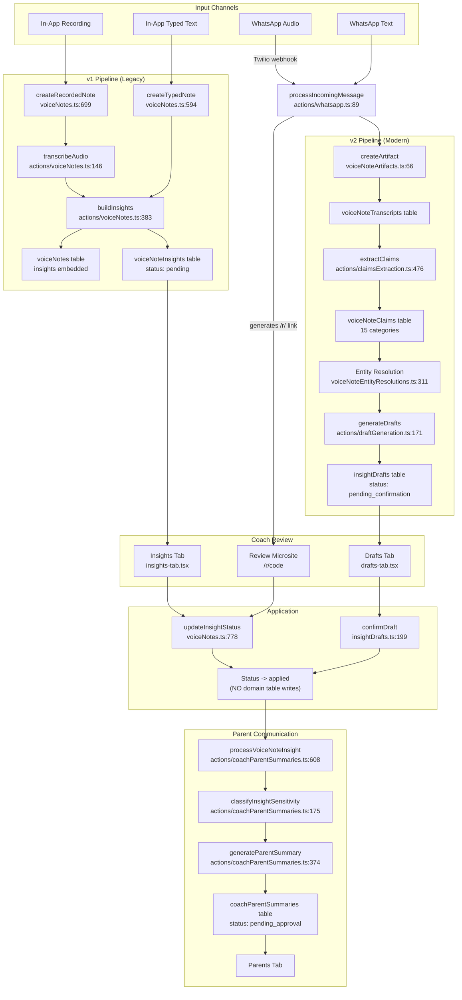

# Voice Notes Pipeline Architecture

**Created:** 2026-03-13
**Source:** [Comprehensive Audit](../../audit/voice-insights-comprehensive-audit.md)
**Related Issues:** #639, #624, #634, #618, #616, #614, #592

---

## Overview

The voice notes system is the most complex feature in PlayerARC: **31 database tables**, **80+ backend functions**, **30+ frontend components**, **23 cron jobs**. It implements a dual-version pipeline (v1 legacy + v2 modern) running in parallel.

### Input Channels

| Channel | Entry Point | Processing Path |
|---------|-------------|-----------------|
| In-app recording | `createRecordedNote` | Upload -> Whisper -> AI extract |
| In-app typed text | `createTypedNote` | Direct AI extract |
| WhatsApp audio | `processIncomingMessage` | Twilio -> Whisper -> v2 pipeline |
| WhatsApp text | `processIncomingMessage` | Direct v2 pipeline |

---

## Pipeline Diagram: v1 vs v2

---

## Flow 1: In-App Voice Note Recording

| Step | Function | File:Line | Tables Written | End State |
|------|----------|-----------|----------------|-----------|
| 1. Coach clicks "Record" | Browser MediaRecorder | `new-note-tab.tsx` | - | Audio captured (webm) |
| 2. Coach clicks "Stop" | `generateUploadUrl` | `voiceNotes.ts` | - | Audio uploaded to S3 |
| 3. Create voice note | `createRecordedNote` | `voiceNotes.ts:699` | `voiceNotes` (status: pending) | Record created |
| 4. Transcription | `transcribeAudio` | `actions/voiceNotes.ts:146` | `voiceNotes` (transcriptionStatus -> completed) | Whisper transcription done |
| 5. Insight extraction | `buildInsights` | `actions/voiceNotes.ts:383` | `voiceNoteInsights` (status: pending) | Insights extracted with categories |
| 6. Player matching | `findMatchingPlayer` | `voiceNotes.ts` | `voiceNoteInsights` (playerIdentityId set if matched) | Players linked |
| 7. v2 (if enabled) | `createArtifact` -> `extractClaims` -> `generateDrafts` | See v2 flow below | v2 pipeline tables | Drafts created |

**End state:** Insights appear in "Insights" tab (v1) or "Drafts" tab (v2).

---

## Flow 2: In-App Typed Text Note

| Step | Function | File:Line | Tables Written | End State |
|------|----------|-----------|----------------|-----------|
| 1. Coach types note | UI form | `new-note-tab.tsx` | - | Text captured |
| 2. Create typed note | `createTypedNote` | `voiceNotes.ts:594` | `voiceNotes` (type: text) | Record created |
| 3. Insight extraction | `buildInsights` | `actions/voiceNotes.ts:383` | `voiceNoteInsights` | Insights extracted |

**End state:** Same as Flow 1 (no transcription step needed).

---

## Flow 3: WhatsApp Audio

| Step | Function | File:Line | Tables Written | End State |
|------|----------|-----------|----------------|-----------|
| 1. Coach sends audio | Twilio webhook | - | - | Audio received |
| 2. Message processing | `processIncomingMessage` | `actions/whatsapp.ts:89` | `whatsappMessages` | Message stored |
| 3. Org resolution | 9 strategies (session -> context -> single-org -> etc.) | `actions/whatsapp.ts` | `whatsappSessions` | Org determined |
| 4. Duplicate check | mediaUrl comparison | `actions/whatsapp.ts` | - | Deduplicated |
| 5. Transcription | Whisper API | `actions/voiceNotes.ts:146` | `voiceNoteTranscripts` | Text extracted |
| 6. v2 pipeline | `createArtifact` -> `extractClaims` -> entity resolution -> `generateDrafts` | See v2 flow | v2 pipeline tables | Drafts created |
| 7. Review link | Generate `/r/[8-char-code]` | `whatsappReviewLinks.ts` | `whatsappReviewLinks` (48h expiry) | Link sent via WhatsApp |

**End state:** Coach receives WhatsApp message with review link to microsite.

---

## Flow 4: WhatsApp Text

Same as Flow 3, minus transcription step. Text is fed directly into `extractClaims`.

---

## Flow 5: v2 Claims Pipeline (Modern)

| Step | Function | File:Line | Tables Written | End State |
|------|----------|-----------|----------------|-----------|
| 1. Create artifact | `createArtifact` | `voiceNoteArtifacts.ts:66` | `voiceNoteArtifacts` (status: processing) | Pipeline entry point |
| 2. Store transcript | internal mutation | `voiceNoteTranscripts.ts` | `voiceNoteTranscripts` | Text + segments stored |
| 3. Extract claims | `extractClaims` | `actions/claimsExtraction.ts:476` | `voiceNoteClaims` (15 categories) | Atomic claims extracted |
| 4. Entity resolution | `resolveEntity` | `voiceNoteEntityResolutions.ts:311` | `voiceNoteEntityResolutions` | Player/team mentions resolved |
| 5. Generate drafts | `generateDrafts` | `actions/draftGeneration.ts:171` | `insightDrafts` (status: pending_confirmation) | Drafts ready for coach review |

**15 claim categories:** skill_rating, injury, attendance, wellbeing, behavior, attitude, fitness, nutrition, sleep, recovery, team_culture, todo, coach_note, general_observation, parent_communication

---

## Flow 6: Entity Resolution

| Step | Function | File:Line | Tables Written | End State |
|------|----------|-----------|----------------|-----------|
| 1. Extract mentions | Part of `extractClaims` | `actions/claimsExtraction.ts` | `voiceNoteClaims.entityMentions[]` | Raw name mentions |
| 2. Candidate matching | `resolveEntity` | `voiceNoteEntityResolutions.ts:311` | `voiceNoteEntityResolutions` | Candidates ranked |
| 3. Coach aliases | Lookup `coachPlayerAliases` | `coachPlayerAliases.ts` | - | Alias -> player mapping |
| 4. Disambiguation | Coach reviews in UI | `disambiguation/[artifactId]` page | `voiceNoteEntityResolutions` (status: resolved) | Players confirmed |

**Known gap:** Entity resolution only searches player roster, not coach roster (#614).

---

## Flow 7: Draft Confirmation

| Step | Function | File:Line | Tables Written | End State |
|------|----------|-----------|----------------|-----------|
| 1. Coach reviews drafts | Drafts Tab UI | `drafts-tab.tsx` | - | Coach sees AI-generated drafts |
| 2. Confirm draft | `confirmDraft` | `insightDrafts.ts:199` | `insightDrafts` (status: confirmed), `voiceNoteInsights` | Insight committed |
| 3. Apply draft (internal) | `applyDraft` | `insightDrafts.ts:529` | `voiceNoteInsights` (status: applied) | Insight applied |

---

## Flow 8: Review Microsite (/r/[code])

| Step | Function | File:Line | Tables Written | End State |
|------|----------|-----------|----------------|-----------|
| 1. Coach opens link | `getReviewLinkByCode` | `whatsappReviewLinks.ts` | - | Validates code + expiry (48h) |
| 2. View pending insights | Query pending insights | `whatsappReviewLinks.ts` | - | List with player names, categories |
| 3. Apply insight | `applyInsightFromReview` | `whatsappReviewLinks.ts` | `voiceNoteInsights` (status: applied) | Applied (same gap: no domain writes) |
| 4. Dismiss insight | `dismissInsightFromReview` | `whatsappReviewLinks.ts` | `voiceNoteInsights` (status: dismissed) | Dismissed |
| 5. Assign player | Search + assign | `whatsappReviewLinks.ts` | `voiceNoteInsights` (playerIdentityId set) | Player linked |
| 6. Snooze | Snooze 1h/4h/tomorrow | `whatsappReviewLinks.ts` | `whatsappReviewLinks` (snoozeUntil set) | Reminder scheduled |

**Known bug:** Apply button clickable without player assigned (#618).

---

## Auto-Apply (Trust Level 2+)

| Step | Function | File:Line | Tables Written | End State |
|------|----------|-----------|----------------|-----------|
| 1. Evaluate auto-apply | `checkAndAutoApply` | `actions/whatsapp.ts:1149` | - | Trust + confidence evaluated |
| 2. Apply automatically | Internal mutation | - | `autoAppliedInsights` (1-hour undo window), `voiceNoteInsights` (status: auto_applied) | Applied with undo option |
| 3. Coach undo (optional) | Undo within 1 hour | - | `autoAppliedInsights` (undoneAt set) | Reverted |

**Trust levels:** 0 (New) -> 1 (Learning, 10+ approvals) -> 2 (Trusted, 50+ approvals) -> 3 (Expert, 200+ approvals, opt-in).

---

## Parent Communication (Post-Apply)

| Step | Function | File:Line | Tables Written | End State |
|------|----------|-----------|----------------|-----------|
| 1. Trigger summary gen | `processVoiceNoteInsight` | `actions/coachParentSummaries.ts:608` | - | Orchestrator starts |
| 2. Classify sensitivity | `classifyInsightSensitivity` | `actions/coachParentSummaries.ts:175` | - | normal/injury/behavior |
| 3. Generate summary | `generateParentSummary` | `actions/coachParentSummaries.ts:374` | `coachParentSummaries` (status: pending_approval) | AI summary created |
| 4. Coach approves | Parents Tab -> Approve & Send | `coachParentSummaries.ts` | `coachParentSummaries` (status: approved) | 1-hour revoke window |
| 5. Delivery | `process-scheduled-deliveries` cron (5 min) | - | `coachParentSummaries` (status: sent) | Sent via WhatsApp/in-app |

**Known bug:** Parent queue broken — insights may not reach approval (#624).

---

## Critical Gap: Type-Specific Application

When a coach clicks "Apply", `updateInsightStatus` (voiceNotes.ts:778) marks the insight as "applied" but does **NOT** update domain-specific tables:

| Category | Domain Table | Writes? |
|----------|-------------|---------|
| todo | `coachTasks` (via `createTaskFromInsight`) | Yes |
| skill_rating | `skillAssessments` | **No** |
| injury | `playerInjuries` | **No** |
| wellbeing | safeguarding records | **No** |
| behavior | behavior records | **No** |
| attendance | attendance records | **No** |
| fitness | fitness records | **No** |
| nutrition | - | **No** |
| sleep | - | **No** |
| recovery | - | **No** |
| attitude | - | **No** |
| team_culture | `teamObservations` | **Partial** (via classify) |
| coach_note | `orgPlayerEnrollments.coachNotes` | **No** |
| general_observation | - | **No** |
| parent_communication | - | **No** |

**Result:** "Applied" status is misleading -- insights are acknowledged, not executed. Only `todo` creates downstream records.

---

## Source File Reference

### Backend Models
| File | Lines | Functions |
|------|-------|-----------|
| `packages/backend/convex/models/voiceNotes.ts` | ~2966 | createTypedNote:594, createRecordedNote:699, updateInsightStatus:778 |
| `packages/backend/convex/models/voiceNoteInsights.ts` | ~2000+ | Dedicated insights CRUD |
| `packages/backend/convex/models/voiceNoteArtifacts.ts` | - | createArtifact:66 |
| `packages/backend/convex/models/voiceNoteEntityResolutions.ts` | - | resolveEntity:311 |
| `packages/backend/convex/models/insightDrafts.ts` | - | confirmDraft:199, applyDraft:529 |
| `packages/backend/convex/models/coachParentSummaries.ts` | ~2000+ | Summary CRUD + approval |
| `packages/backend/convex/models/coachTrustLevels.ts` | ~800+ | Trust level management |
| `packages/backend/convex/models/whatsappReviewLinks.ts` | ~400+ | Microsite mutations |

### Backend Actions
| File | Lines | Functions |
|------|-------|-----------|
| `packages/backend/convex/actions/voiceNotes.ts` | ~1415 | transcribeAudio:146, buildInsights:383 |
| `packages/backend/convex/actions/claimsExtraction.ts` | - | extractClaims:476 |
| `packages/backend/convex/actions/draftGeneration.ts` | - | generateDrafts:171 |
| `packages/backend/convex/actions/coachParentSummaries.ts` | ~1174 | classifyInsightSensitivity:175, generateParentSummary:374, processVoiceNoteInsight:608 |
| `packages/backend/convex/actions/whatsapp.ts` | ~2345 | processIncomingMessage:89, checkAndAutoApply:1149 |

### Frontend Components
| File | Lines | Purpose |
|------|-------|---------|
| `apps/web/src/app/orgs/[orgId]/coach/voice-notes/voice-notes-dashboard.tsx` | ~900 | Main dashboard, 9 tabs |
| `apps/web/src/app/orgs/[orgId]/coach/voice-notes/components/insights-tab.tsx` | ~2102 | Core insight review |
| `apps/web/src/app/orgs/[orgId]/coach/voice-notes/components/auto-approved-tab.tsx` | ~628 | Sent to Parents |
| `apps/web/src/app/orgs/[orgId]/coach/voice-notes/components/my-impact-tab.tsx` | ~338 | Impact dashboard |
| `apps/web/src/app/orgs/[orgId]/coach/voice-notes/components/drafts-tab.tsx` | ~430 | v2 draft review |
| `apps/web/src/app/orgs/[orgId]/coach/voice-notes/components/new-note-tab.tsx` | ~289 | Recording/typing |
